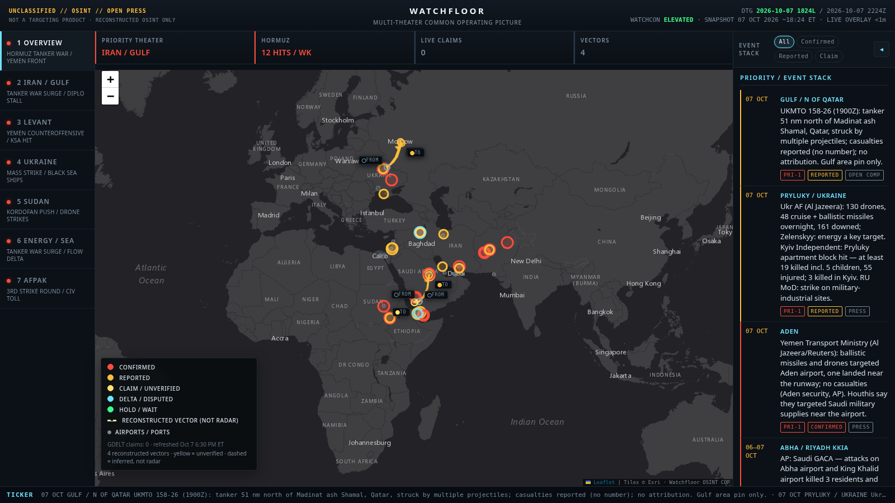

# Watchfloor

An unclassified, open-source **OSINT common operating picture** for following several conflicts at once.

**Live map:** https://memery33.github.io/watchfloor/



Watchfloor is a watch-floor view, not a news site. Every item on the map carries a confidence tag and a source. Anything that isn't backed by named, corroborating sources stays **yellow** as a claim. It is **not a targeting product and not radar.**

## How sources are vetted

- **Named sources only.** Every event cites who reported it (wire services, official statements, UKMTO, named outlets).
- **Claims stay yellow.** State media, militant channels, and automated news extraction are shown as CLAIM. They are promoted only when an independent, named source corroborates the same event, place, and date.
- **Disagreement is shown, not resolved.** When two credible sources contradict each other, the item is marked DELTA and both accounts stay visible.
- **No coordinates, no marker.** Nothing is plotted on a guessed location.
- **No two named ends, no arc.** Dashed missile and drone vectors are drawn only when both the launch point and the impact are named. They are reconstructions, not live tracks.

## What the colors mean

| Tag | Color | Meaning |
| --- | --- | --- |
| CONFIRMED | red | Named and corroborated. Still not targeting quality. |
| REPORTED | amber | Open press or official statement, not independently verified here. |
| CLAIM | yellow | State, militant, or automated extraction. Shown, not trusted. |
| DELTA | cyan | Credible sources contradict each other. |
| HOLD | green | Waiting on more information. |

## What's on the map

- Seven theaters: Overview, Iran/Gulf, Levant, Ukraine, Sudan, Energy/Sea, and AfPak (keys `1`–`7`)
- Curated event stack for each theater, with source class and confidence
- Reconstructed missile and drone vectors where both ends are named
- Dark English basemap from Esri
- Live GDELT claim layer (below)

## The live claim layer is often empty, on purpose

A yellow layer from [GDELT](https://www.gdeltproject.org/) refreshes automatically. It keeps only strike, shelling, and blockade events inside the watched areas, and it drops country-level default locations, known bad geocodes, and vague actors. Those filters are strict, so the layer is frequently empty. An empty layer means nothing passed the filters, not that the feed is broken. The legend always shows the current count and the last refresh time, for example `GDELT claims: 0 · refreshed Oct 7, 6:30 PM ET`.

Every GDELT row is a CLAIM. None of it moves into the curated sitrep without named corroboration.

## How it stays current

- **Curated sitrep:** `src/sitrep.ts` and the per-theater `src/sitrep.*.ts` files, with a snapshot timestamp shown in the header.
- **Live layer:** `scripts/fetch_live.py` writes `public/data/live.json`. Every site build fetches the overlay fresh, so the deployed map is as current as its last build. A scheduled GitHub Action (nominally hourly, often less often) keeps the repo copy current and requests a site rebuild.
- **Vectors:** `src/tracks.ts`, curated by hand.
- **Site:** GitHub Pages rebuilds on every push to `main`, with a scheduled rebuild as a fallback.

## Run locally

```bash
npm install
python3 scripts/fetch_live.py
npm run dev
```

Keys: `1`–`7` switch theaters, `F` toggles fullscreen.

## Public by design

Open sources only. No classified, FOUO, or private Telegram material. If it can't be sourced publicly, it is a yellow claim or it does not plot.

## License

MIT
